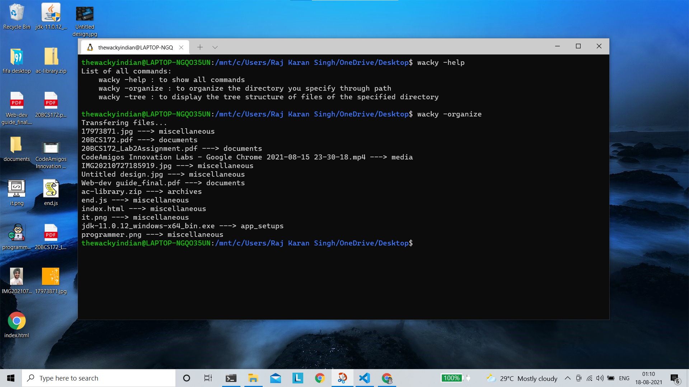

# play_with_files
Helps managing clutter of files in a directory.

Also displays tree hierarchal structure of the specified directory.

# Installation

Make sure you have node installed.

You can get it here:
 https://nodejs.org/en/

Then....

 `npm install -g play_with_files`

then....

 `wacky -help`
 
 `wacky -organize <directory-path> `
 
 and related commands.

## Commands
play_with_files currently support following commands:

` -help
  -organize
  -tree
  -revert
  `
 
 
 #### DesktopView before : 
 
 
 #### Usage :
 
 
 #### DesktopView after :
  
